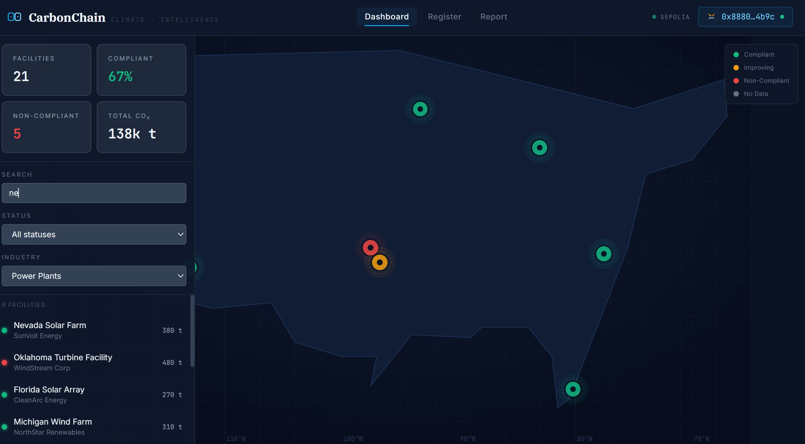
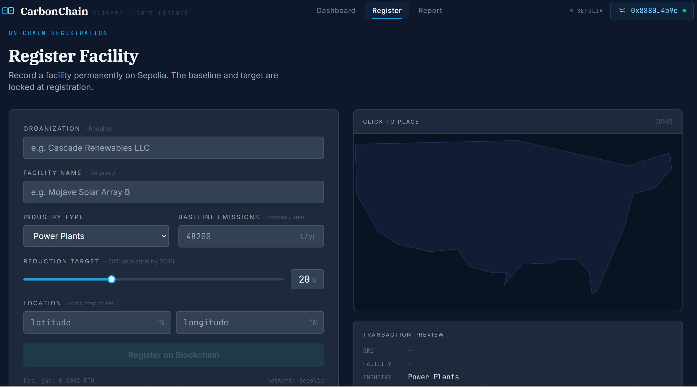
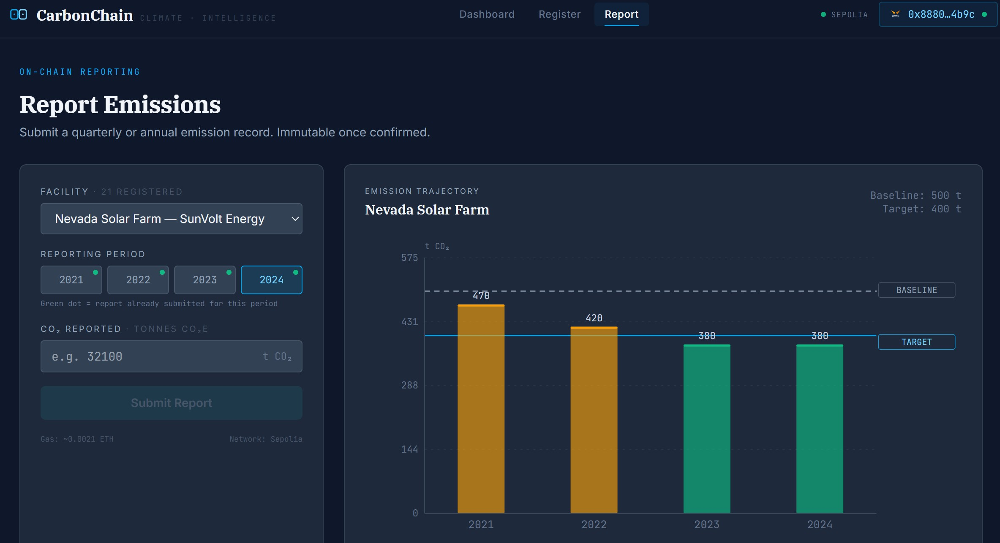

# CarbonChain — Decentralized Carbon Footprint Reporting

A blockchain-based platform for transparent, verifiable facility-level carbon emission reporting with geospatial risk analysis.

## Screenshots


*Dashboard: 21 facilities plotted on a custom SVG CONUS map, color-coded by compliance status with live filters*


*Register: on-chain facility registration form with live map pin placement and transaction preview*


*Report: live compliance preview as you type, emission trajectory chart, one-click on-chain submission*

---

## Live Demo

- **Frontend:** [Netlify URL — coming soon]
- **Contract:** [0xc42f5c64d5FC1155A061BE4508C7004B0Cf6225D](https://sepolia.etherscan.io/address/0xc42f5c64d5FC1155A061BE4508C7004B0Cf6225D) on Sepolia testnet

---

## Architecture

```
┌─────────────────────────────────────────────────────────────┐
│                  React Frontend (Netlify)                     │
│                                                               │
│  ┌─────────────┐  ┌──────────────┐  ┌───────────────────┐   │
│  │  Dashboard  │  │   Register   │  │      Report       │   │
│  │  SVG Map    │  │  + Map Pin   │  │  Live Compliance  │   │
│  │  Filters    │  │  MetaMask tx │  │  MetaMask tx      │   │
│  └─────────────┘  └──────────────┘  └───────────────────┘   │
│                                                               │
│  ┌────────────────────────────────────────────────────────┐  │
│  │              Facility Detail Page                       │  │
│  │  Emission Chart · FEMA Risk Badges · On-Chain Table    │  │
│  └────────────────────────────────────────────────────────┘  │
└──────────┬──────────────────────────┬────────────────────────┘
           │                          │
           │ window.ethereum          │ Supabase JS Client
           │ ethers.js v6             │
           │                          │
┌──────────▼──────────┐   ┌──────────▼──────────────────────┐
│   Sepolia Testnet    │   │   Supabase (PostgreSQL+PostGIS)  │
│                      │   │                                  │
│  CarbonRegistry.sol  │   │  Tables:                         │
│                      │   │  · facilities (GEOGRAPHY POINT)  │
│  · registerFacility  │   │  · emission_reports              │
│  · reportEmissions   │   │  · fema_risk_index               │
│  · getReports        │   │  · us_states                     │
│  · getFacility       │   │                                  │
│                      │   │  PostGIS RPC Functions:          │
│  Events:             │   │  · nearby_facilities()           │
│  · FacilityRegistered│   │  · facilities_in_risk_zones()    │
│  · EmissionReported  │   │  · emissions_by_state()          │
│                      │   │  · facility_risk_score()         │
└─────────────────────┘   └──────────────────────────────────┘
```

### Dual-Write Pattern

Every on-chain write also writes to Supabase:

```
User Action
    │
    ├─► MetaMask signs tx ──► Sepolia smart contract (immutable record)
    │                              │
    │                              └─► tx hash returned
    │
    └─► Supabase insert (fast reads, spatial queries, map rendering)
              └─► stores tx hash for Etherscan verification
```

---

## Why Blockchain?

Emission data is immutable once reported — organizations cannot retroactively edit or manipulate historical records. Every report has a verifiable on-chain transaction hash. This creates the transparency and accountability needed for finance-ready climate due diligence.

Corporate carbon reporting has three systemic failures:
- **Inadequate verification** — leading carbon standard providers overrepresent credits
- **Double counting** — same offsets claimed by multiple parties
- **Limited transparency** — organizations can suppress unfavorable records

Blockchain's immutability + smart contract auto-verification directly addresses all three.

---

## Tech Stack

| Layer | Technology |
|---|---|
| Smart Contract | Solidity 0.8.20 + Hardhat + Sepolia testnet |
| Database | Supabase (PostgreSQL + PostGIS) |
| Frontend | React 18 + Vite + Tailwind CSS (CDN) |
| Maps | Custom SVG CONUS map with equirectangular projection |
| Charts | Custom SVG emission history chart |
| Blockchain | ethers.js v6 + window.ethereum (MetaMask) |
| Deployment | Netlify (frontend) + Supabase (db) + Sepolia (contract) |

---

## Smart Contract

**`contracts/CarbonRegistry.sol`** — deployed on Sepolia at `0xc42f5c64d5FC1155A061BE4508C7004B0Cf6225D`

Key functions:
- `registerFacility()` — registers facility on-chain with baseline + reduction target
- `reportEmissions()` — submits emission record, auto-calculates compliance
- `getReports()` — returns full emission history for a facility
- `getOrgFacilities()` — returns all facility IDs owned by a wallet

Compliance is calculated entirely on-chain:
```solidity
uint256 targetEmissions = baselineEmissions * (100 - reductionTarget) / 100;
bool meetsTarget = co2Tonnes <= targetEmissions;
```

---

## Database Schema (PostGIS)

```sql
facilities          -- mirrors on-chain data, GEOGRAPHY(POINT) for spatial queries
emission_reports    -- all reports with tx_hash for Etherscan verification
fema_risk_index     -- FEMA National Risk Index county-level risk scores
us_states           -- US state boundary polygons for choropleth
```

Four spatial RPC functions callable from the frontend:
- `nearby_facilities(lat, lng, radius)` — ST_DWithin proximity search
- `facilities_in_risk_zones(risk_type)` — joins facilities to FEMA NRI by county
- `emissions_by_state()` — aggregates emissions per state for choropleth
- `facility_risk_score(id)` — composite: emission compliance + FEMA NRI score

---

## Project Structure

```
carbon-chain/
├── contracts/
│   └── CarbonRegistry.sol          # Main smart contract
├── test/
│   └── CarbonRegistry.test.js      # 24 Hardhat tests (all passing)
├── scripts/
│   ├── deploy.js                   # Deploy to Sepolia
│   └── prepare_epa_data.py         # EPA GHGRP CSV → Supabase seed SQL
├── supabase/
│   ├── schema.sql                  # Tables + PostGIS + indexes
│   ├── rpc_functions.sql           # 4 PostGIS spatial functions
│   ├── seed_facilities.sql         # 15 US facilities across 13 states
│   └── seed_reports.sql            # 45 emission reports (2021-2023)
├── frontend/
│   └── src/
│       ├── components/             # Navbar, MapView, EmissionChart, badges
│       ├── pages/                  # Dashboard, Register, Report, FacilityDetail
│       ├── hooks/                  # useWallet, useFacilities, useContract
│       └── lib/                    # wagmi config, supabase client, contract ABI
├── hardhat.config.js
└── package.json
```

---

## Setup

### Prerequisites
- Node.js 18+
- MetaMask browser extension
- Sepolia ETH (from [sepoliafaucet.com](https://sepoliafaucet.com))

### 1. Install dependencies
```bash
npm install
cd frontend && npm install
```

### 2. Configure environment
```bash
# Root .env (Hardhat)
cp .env.example .env
# Add SEPOLIA_RPC_URL and DEPLOYER_PRIVATE_KEY

# Frontend .env
cp frontend/.env.example frontend/.env
# Add VITE_SUPABASE_URL, VITE_SUPABASE_ANON_KEY, VITE_CONTRACT_ADDRESS
```

### 3. Deploy contract
```bash
node node_modules/hardhat/internal/cli/cli.js run scripts/deploy.js --network sepolia
```

### 4. Set up Supabase
Run these in order in the Supabase SQL Editor:
```
supabase/schema.sql
supabase/rpc_functions.sql
supabase/seed_facilities.sql
supabase/seed_reports.sql
```

Disable RLS for demo:
```sql
ALTER TABLE facilities DISABLE ROW LEVEL SECURITY;
ALTER TABLE emission_reports DISABLE ROW LEVEL SECURITY;
```

### 5. Run frontend
```bash
cd frontend && node_modules/.bin/vite
```

Open [http://localhost:5173](http://localhost:5173)

### 6. Run tests
```bash
node node_modules/hardhat/internal/cli/cli.js test
# 24 passing
```

---

## Data Sources

- **EPA GHGRP** — 8,000+ facility-level emissions, public download ([epa.gov/ghgreporting](https://www.epa.gov/ghgreporting/data-sets))
- **FEMA NRI v1.20** — County-level risk scores for 18 natural hazards ([hazards.fema.gov/nri](https://hazards.fema.gov/nri/data-resources))
- **US Census TIGER/Line** — State boundary polygons

---

## Design System

- **Background:** `#0f172a` (deep navy)
- **Surface:** `#1e293b` (slate)
- **Primary action:** `#0ea5e9` (sky cyan)
- **Compliant:** `#10b981` · **Improving:** `#f59e0b` · **Non-compliant:** `#ef4444`
- **Typography:** IBM Plex Serif (display) · JetBrains Mono (data) · Inter (UI)
- **Mood:** Bloomberg Terminal meets climate intelligence

---

## References

- Cornell CATchain-R: Blockchain-based carbon registry (npj Climate Action, Feb 2026)
- EU Blockchain for Climate Action (digital-strategy.ec.europa.eu)
- ISO 14064: International standard for GHG accounting and verification
